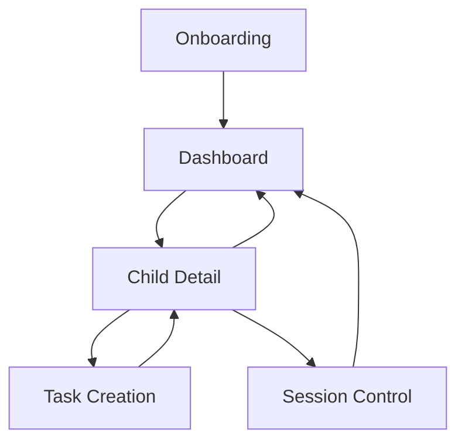

## 1. Product Overview
IROKO Parent App empowers parents to manage their children's daily tasks, behaviors, and digital discipline through an intuitive Android interface. The app provides complete oversight of child activities, task assignments, and session controls while maintaining offline-first functionality.

Target users are parents seeking structured digital parenting tools with real-time monitoring and offline capabilities for consistent child management.

## 2. Core Features

### 2.1 User Roles
| Role | Registration Method | Core Permissions |
|------|---------------------|------------------|
| Parent | Email registration via Supabase Auth | Full child management, task creation, session control, insights viewing |

### 2.2 Feature Module
Our Parent App requirements consist of the following main screens:
1. **Onboarding**: Profile creation, child setup, discipline configuration
2. **Dashboard**: Children overview, daily summary, alerts management
3. **Child Detail**: Task management, skill tracking, rewards, behavior timeline
4. **Task Creation**: Category selection, scheduling, reward attachment
5. **Session Control**: Active device monitoring, session revocation

### 2.3 Page Details
| Page Name | Module Name | Feature description |
|-----------|-------------|---------------------|
| Onboarding | Profile Creation | Collect parent name, email, password for Supabase auth registration |
| Onboarding | Child Creation | Create child profile via Edge Function with unique identifier and parent linkage |
| Onboarding | Discipline Setup | Configure task categories, reward system, and behavioral parameters |
| Dashboard | Children List | Display all parent-associated children with profile pictures and status indicators |
| Dashboard | Today Overview | Show aggregated daily progress, completed tasks, and pending items across all children |
| Dashboard | Alerts Strip | Display urgent notifications for missed tasks, behavioral issues, or system alerts |
| Child Detail | Tasks Today | List time-blocked tasks with completion status, priority indicators, and quick actions |
| Child Detail | Skill Summaries | Visual progress charts for behavioral skills, completion rates, and improvement trends |
| Child Detail | Rewards Wallet | Display earned points, available rewards, and redemption history with balance tracking |
| Child Detail | Behavior Timeline | Chronological feed of task completions, behavioral events, and milestone achievements |
| Task Creation | Category Selection | Choose from predefined categories (chores, homework, hygiene, etc.) with custom options |
| Task Creation | Schedule | Set recurring patterns, specific times, and duration requirements with reminder settings |
| Task Creation | Reward Attachment | Assign point values, badge rewards, or privilege unlocks for task completion |
| Task Creation | Local Reminders | Configure device-specific notifications with quiet hours respect and snooze options |
| Session Control | Active Device View | Monitor currently logged-in devices per child with location and timestamp data |
| Session Control | Revoke Button | Immediately terminate child sessions with confirmation dialog and audit logging |

## 3. Core Process
Parent Flow: Onboarding → Dashboard → Child Management → Task Assignment → Monitoring → Session Control

## 4. User Interface Design

### 4.1 Design Style
- **Primary Colors**: Deep purple (#6B46C1) for primary actions, soft gray (#F3F4F6) for backgrounds
- **Button Style**: Rounded rectangles with elevation shadows, purple gradient for CTAs
- **Typography**: Roboto font family, 16sp for body, 20sp for headers, 14sp for captions
- **Layout**: Card-based with 8dp grid system, bottom navigation for main sections
- **Icons**: Material Design icons with rounded corners, purple tint for active states

### 4.2 Page Design Overview
| Page Name | Module Name | UI Elements |
|-----------|-------------|-------------|
| Onboarding | Profile Creation | Purple gradient background, white input cards with 12dp rounded corners, floating action button |
| Dashboard | Children List | Horizontal card carousel with child avatars, status badges with green/red indicators |
| Child Detail | Tasks Today | Vertical timeline with time blocks, completion checkboxes with animated transitions |
| Task Creation | Category Selection | Grid layout with category icons, selected state with purple border and checkmark |
| Session Control | Active Device View | Device cards with location maps, revoke buttons with warning color scheme |

### 4.3 Responsiveness
Desktop-first design with tablet optimization, responsive grid layouts adapting to screen sizes from 360dp to 1280dp width.

### 4.4 3D Scene Guidance
Not applicable - 2D Android native interface with Material Design principles.