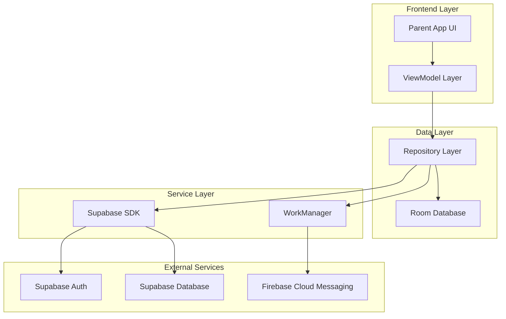
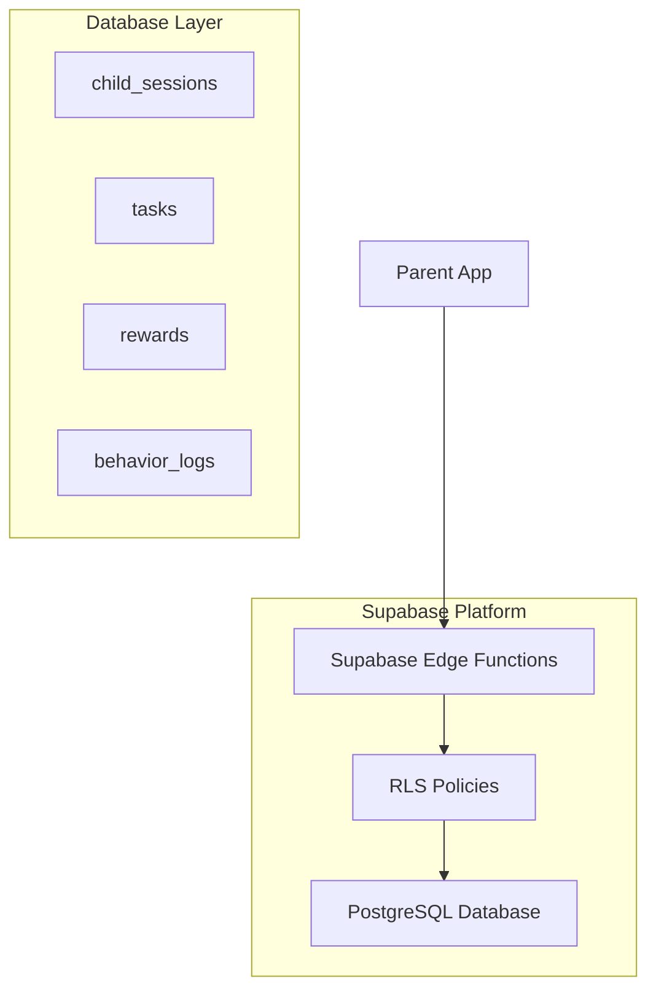
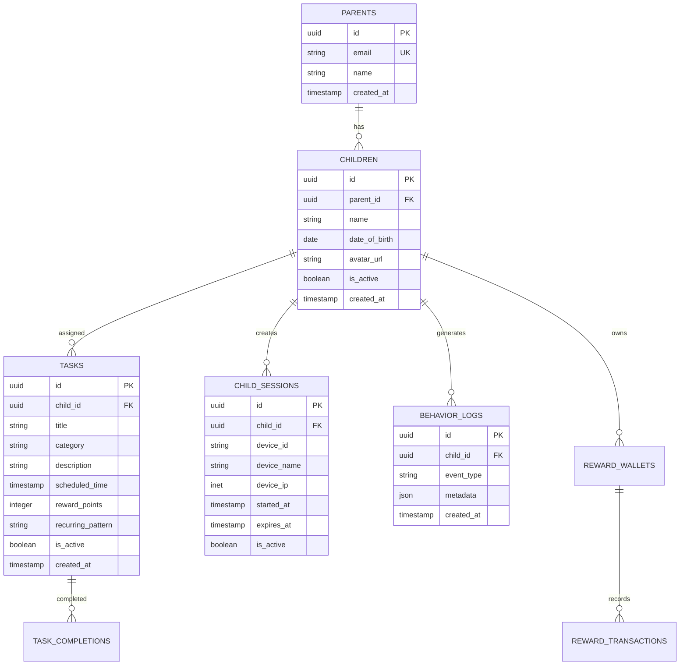

## 1. Architecture Design



## 2. Technology Description

* **Frontend**: Kotlin + Jetpack Compose + Material Design 3

* **Architecture**: MVVM with Repository pattern + Hilt DI

* **Local Database**: Room with offline-first approach

* **Sync**: WorkManager for background synchronization

* **Backend**: Supabase (Auth + PostgreSQL + Edge Functions)

* **Notifications**: Firebase Cloud Messaging

* **Image Loading**: Coil for Compose

* **Navigation**: Jetpack Navigation Compose

## 3. Route Definitions

| Route                     | Purpose                                                  |
| ------------------------- | -------------------------------------------------------- |
| /onboarding               | Initial setup flow for parent profile and child creation |
| /dashboard                | Main parent dashboard with children overview             |
| /child/{childId}          | Detailed view for specific child management              |
| /child/{childId}/tasks    | Task creation and management for child                   |
| /child/{childId}/sessions | Active session monitoring and control                    |
| /settings                 | Parent app configuration and profile management          |

## 4. API Definitions

### 4.1 Authentication APIs

```
POST /auth/v1/token
```

Request:

```json
{
  "email": "parent@example.com",
  "password": "securePassword123",
  "device_id": "android-device-uuid"
}
```

### 4.2 Child Management APIs

```
POST /rest/v1/children
```

Request:

```json
{
  "parent_id": "auth.user_id",
  "name": "Child Name",
  "date_of_birth": "2015-01-01",
  "avatar_url": "https://..."
}
```

### 4.3 Task Management APIs

```
POST /rest/v1/tasks
```

Request:

```json
{
  "child_id": "child-uuid",
  "title": "Complete Homework",
  "category": "education",
  "scheduled_time": "2024-01-15T15:00:00Z",
  "reward_points": 10,
  "recurring_pattern": "daily"
}
```

### 4.4 Session Control APIs

```
{
  "child_id": "child-uuid",
  "title": "Complete Homework",
  "category": "education",
  "scheduled_time": "2024-01-15T15:00:00Z",
  "reward_points": 10,
  "recurring_pattern": "daily"
}
```

Headers: `Authorization: Bearer {parent_jwt}`

## 5. Server Architecture Diagram



## 6. Data Model

### 6.1 Database Schema



### 6.2 Data Definition Language

**Parents Table**

```sql
CREATE TABLE parents (
    id UUID PRIMARY KEY DEFAULT auth.uid(),
    email VARCHAR(255) UNIQUE NOT NULL,
    name VARCHAR(100) NOT NULL,
    created_at TIMESTAMP WITH TIME ZONE DEFAULT NOW(),
    updated_at TIMESTAMP WITH TIME ZONE DEFAULT NOW()
);

-- RLS Policies
ALTER TABLE parents ENABLE ROW LEVEL SECURITY;
CREATE POLICY "Users can view own parent profile" ON parents
    FOR SELECT USING (auth.uid() = id);
```

**Children Table**

```sql
CREATE TABLE children (
    id UUID PRIMARY KEY DEFAULT gen_random_uuid(),
    parent_id UUID NOT NULL REFERENCES parents(id) ON DELETE CASCADE,
    name VARCHAR(100) NOT NULL,
    date_of_birth DATE,
    avatar_url TEXT,
    is_active BOOLEAN DEFAULT true,
    created_at TIMESTAMP WITH TIME ZONE DEFAULT NOW(),
    updated_at TIMESTAMP WITH TIME ZONE DEFAULT NOW()
);

-- RLS Policies
ALTER TABLE children ENABLE ROW LEVEL SECURITY;
CREATE POLICY "Parents can view own children" ON children
    FOR SELECT USING (auth.uid() = parent_id);
CREATE POLICY "Parents can insert own children" ON children
    FOR INSERT WITH CHECK (auth.uid() = parent_id);
```

**Tasks Table**

```sql
CREATE TABLE tasks (
    id UUID PRIMARY KEY DEFAULT gen_random_uuid(),
    child_id UUID NOT NULL REFERENCES children(id) ON DELETE CASCADE,
    title VARCHAR(200) NOT NULL,
    category VARCHAR(50) NOT NULL,
    description TEXT,
    scheduled_time TIMESTAMP WITH TIME ZONE,
    reward_points INTEGER DEFAULT 0,
    recurring_pattern VARCHAR(20) CHECK (recurring_pattern IN ('none', 'daily', 'weekly', 'monthly')),
    is_active BOOLEAN DEFAULT true,
    created_at TIMESTAMP WITH TIME ZONE DEFAULT NOW(),
    updated_at TIMESTAMP WITH TIME ZONE DEFAULT NOW()
);

-- RLS Policies
ALTER TABLE tasks ENABLE ROW LEVEL SECURITY;
CREATE POLICY "Parents can manage child tasks" ON tasks
    FOR ALL USING (
        auth.uid() IN (
            SELECT parent_id FROM children WHERE id = child_id
        )
    );
```

**Child Sessions Table**

```sql
CREATE TABLE child_sessions (
    id UUID PRIMARY KEY DEFAULT gen_random_uuid(),
    child_id UUID NOT NULL REFERENCES children(id) ON DELETE CASCADE,
    device_id VARCHAR(255) NOT NULL,
    device_name VARCHAR(100),
    device_ip INET,
    started_at TIMESTAMP WITH TIME ZONE DEFAULT NOW(),
    expires_at TIMESTAMP WITH TIME ZONE DEFAULT NOW() + INTERVAL '24 hours',
    is_active BOOLEAN DEFAULT true,
    created_at TIMESTAMP WITH TIME ZONE DEFAULT NOW()
);

-- RLS Policies
ALTER TABLE child_sessions ENABLE ROW LEVEL SECURITY;
CREATE POLICY "Parents can view child sessions" ON child_sessions
    FOR SELECT USING (
        auth.uid() IN (
            SELECT parent_id FROM children WHERE id = child_id
        )
    );
CREATE POLICY "Parents can revoke child sessions" ON child_sessions
    FOR DELETE USING (
        auth.uid() IN (
            SELECT parent_id FROM children WHERE id = child_id
        )
    );
```

## 7. Offline-First Implementation

### 7.1 Room Database Schema

```kotlin
@Entity(tableName = "tasks")
data class TaskEntity(
    @PrimaryKey val id: String,
    val childId: String,
    val title: String,
    val category: String,
    val description: String?,
    val scheduledTime: Instant?,
    val rewardPoints: Int,
    val recurringPattern: String,
    val isActive: Boolean,
    val syncStatus: SyncStatus,
    val createdAt: Instant,
    val updatedAt: Instant
)

@Entity(tableName = "children")
data class ChildEntity(
    @PrimaryKey val id: String,
    val parentId: String,
    val name: String,
    val dateOfBirth: LocalDate?,
    val avatarUrl: String?,
    val isActive: Boolean,
    val syncStatus: SyncStatus,
    val createdAt: Instant,
    val updatedAt: Instant
)
```

### 7.2 Sync Strategy

* **Pull Sync**: WorkManager periodic job every 15 minutes when online

* **Push Sync**: Immediate sync for critical operations (task creation, session revocation)

* **Conflict Resolution**: Last-write-wins with parent authority override

* **Retry Logic**: Exponential backoff with maximum 5 attempts

### 7.3 WorkManager Configuration

```kotlin
val syncRequest = PeriodicWorkRequestBuilder<SyncWorker>(
    15, TimeUnit.MINUTES
).setConstraints(
    Constraints.Builder()
        .setRequiredNetworkType(NetworkType.CONNECTED)
        .setRequiresBatteryNotLow(true)
        .build()
).build()
```

