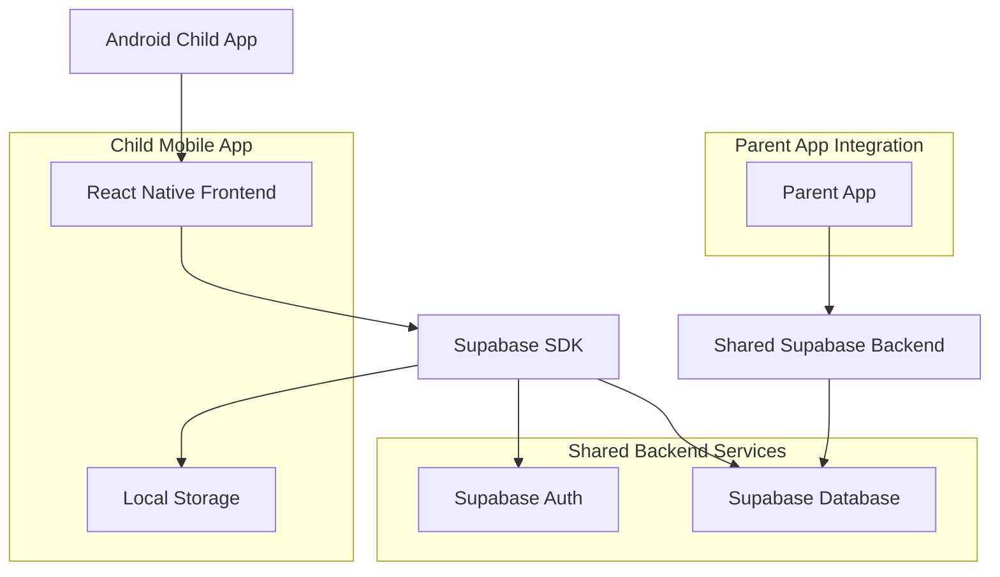
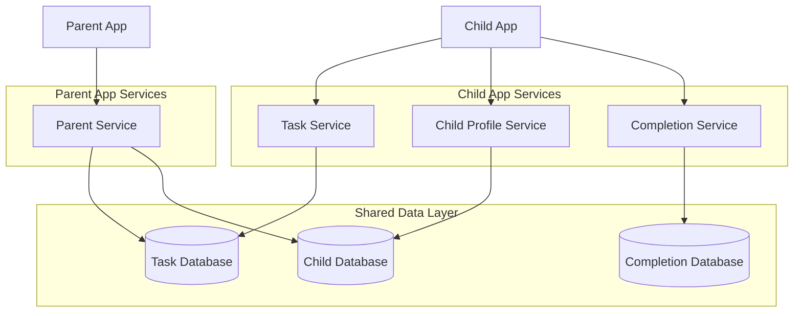
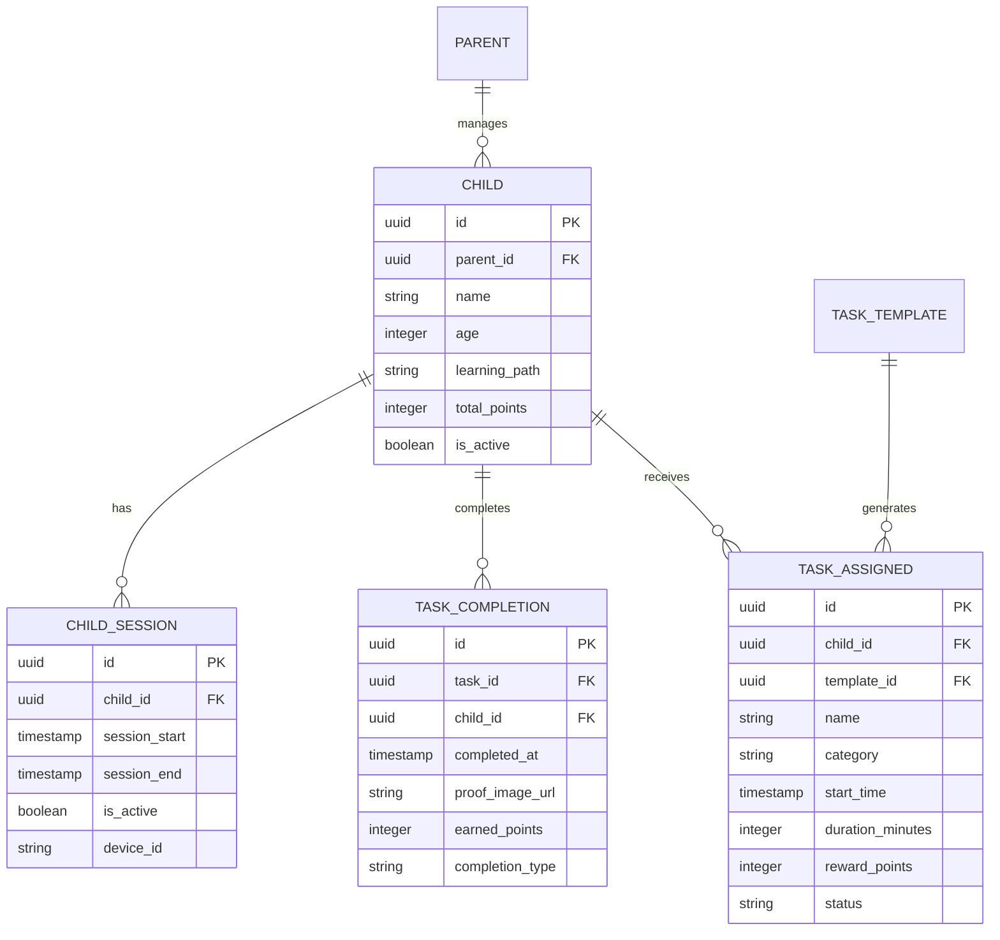

## 1. Architecture design



## 2. Technology Description
- **Frontend**: React Native@0.72 + Native Android Components
- **Backend**: Supabase (PostgreSQL, Auth, Real-time)
- **Local Storage**: AsyncStorage for offline task data
- **State Management**: React Context + Local Storage
- **Push Notifications**: Firebase Cloud Messaging (parent-controlled)
- **Timer/Alarms**: React Native Background Timer
- **Initialization Tool**: React Native CLI

## 3. Route definitions
| Route | Purpose |
|-------|---------|
| /child/my-day | Daily task overview with morning/afternoon/evening sections |
| /child/task/:id | Individual task focus screen with timer |
| /child/task-complete/:id | Task completion confirmation with optional photo proof |
| /child/daily-summary | End-of-day summary with points and encouragement |
| /child/offline-mode | Offline indicator when connection lost |

## 4. API definitions

### 4.1 Task Management APIs

**Get Child's Daily Tasks**
```
GET /api/child/:child_id/tasks/today
```

Response:
| Param Name | Param Type | Description |
|------------|-------------|-------------|
| tasks | array | Array of task objects |
| task.id | uuid | Task identifier |
| task.name | string | Task name |
| task.start_time | timestamp | Task scheduled time |
| task.duration | integer | Task duration in minutes |
| task.category | string | Task category |
| task.reward_points | integer | Points for completion |
| task.status | string | Current task status |

**Complete Task**
```
POST /api/child/:child_id/tasks/:task_id/complete
```

Request:
| Param Name | Param Type | isRequired | Description |
|------------|-------------|-------------|-------------|
| proof_image | string | false | Base64 encoded image (optional) |
| completion_time | timestamp | true | When task was completed |

Response:
| Param Name | Param Type | Description |
|------------|-------------|-------------|
| success | boolean | Completion status |
| earned_points | integer | Points awarded |
| new_total | integer | Child's new total points |

### 4.2 Child Profile APIs

**Get Child Profile**
```
GET /api/child/:child_id/profile
```

Response:
| Param Name | Param Type | Description |
|------------|-------------|-------------|
| name | string | Child's name |
| age | integer | Child's age |
| learning_path | string | Selected learning focus |
| total_points | integer | Current point balance |
| daily_streak | integer | Consecutive days completed |

## 5. Server architecture diagram



## 6. Data model

### 6.1 Data model definition



### 6.2 Data Definition Language

**Child Sessions Table**
```sql
-- Create child_sessions table for tracking app usage
CREATE TABLE child_sessions (
    id UUID PRIMARY KEY DEFAULT gen_random_uuid(),
    child_id UUID NOT NULL REFERENCES children(id) ON DELETE CASCADE,
    session_start TIMESTAMP WITH TIME ZONE DEFAULT NOW(),
    session_end TIMESTAMP WITH TIME ZONE,
    is_active BOOLEAN DEFAULT true,
    device_id VARCHAR(100),
    created_at TIMESTAMP WITH TIME ZONE DEFAULT NOW()
);

-- Create indexes
CREATE INDEX idx_sessions_child_id ON child_sessions(child_id);
CREATE INDEX idx_sessions_active ON child_sessions(is_active);
CREATE INDEX idx_sessions_start_time ON child_sessions(session_start DESC);
```

**Task Completions Child View**
```sql
-- Create view for child app to see only their completions
CREATE VIEW child_task_completions AS
SELECT 
    tc.id,
    tc.task_id,
    tc.child_id,
    tc.completed_at,
    tc.earned_points,
    tc.completion_type,
    t.name as task_name,
    t.category as task_category
FROM task_completions tc
JOIN tasks t ON tc.task_id = t.id
WHERE tc.child_id = auth.uid();

-- RLS Policy for child completions
CREATE POLICY "Children can view own completions" ON task_completions
    FOR SELECT USING (child_id = auth.uid());

GRANT SELECT ON child_task_completions TO authenticated;
```

**Offline Sync Queue**
```sql
-- Create offline sync queue for child app
CREATE TABLE offline_sync_queue (
    id UUID PRIMARY KEY DEFAULT gen_random_uuid(),
    child_id UUID NOT NULL REFERENCES children(id) ON DELETE CASCADE,
    operation_type VARCHAR(20) NOT NULL CHECK (operation_type IN ('task_complete', 'proof_upload')),
    payload JSONB NOT NULL,
    retry_count INTEGER DEFAULT 0,
    is_synced BOOLEAN DEFAULT false,
    created_at TIMESTAMP WITH TIME ZONE DEFAULT NOW(),
    synced_at TIMESTAMP WITH TIME ZONE
);

-- Create indexes
CREATE INDEX idx_sync_queue_child_id ON offline_sync_queue(child_id);
CREATE INDEX idx_sync_queue_synced ON offline_sync_queue(is_synced);
CREATE INDEX idx_sync_queue_created ON offline_sync_queue(created_at);
```

**Supabase Real-time Subscriptions**
```sql
-- Enable real-time for child app
ALTER PUBLICATION supabase_realtime ADD TABLE task_assigned;
ALTER PUBLICATION supabase_realtime ADD TABLE task_completions;

-- Child-specific RLS policies
CREATE POLICY "Children can only see own assigned tasks" ON tasks
    FOR SELECT USING (child_id = auth.uid());

CREATE POLICY "Children can update own task completions" ON task_completions
    FOR INSERT USING (child_id = auth.uid());
```