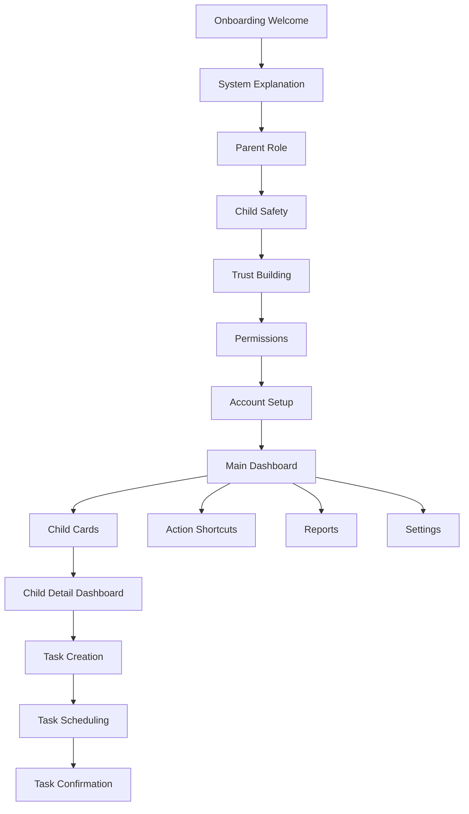

## 1. Product Overview
IROKO is an African-rooted parenting and child development platform designed to help parents raise disciplined, skilled, financially aware, and purpose-driven children through structure, monitoring, rewards, and guidance. The platform provides parents with tools to guide their children's development while maintaining cultural values and building legacy.

The IROKO Parent App serves as the primary interface for parents to manage their children's development journey, offering comprehensive monitoring, task management, and reward systems tailored for African families aged 25-50 in urban and semi-urban areas.

## 2. Core Features

### 2.1 User Roles
| Role | Registration Method | Core Permissions |
|------|---------------------|------------------|
| Parent | Email registration, phone verification | Full access to all features, manage multiple children, create tasks, approve rewards, view reports |
| Child | Parent invitation only | Limited access to assigned tasks, view progress, complete activities |

### 2.2 Feature Module
Our IROKO Parent App consists of the following main flows:
1. **Onboarding Flow**: Welcome screens, system explanation, parent role positioning, child experience overview, data trust building, permissions, and account setup
2. **Main Dashboard**: Parent greeting, child status overview, action shortcuts, bottom navigation
3. **Child Detail Dashboard**: Child identity, skill growth overview, daily task status, reward management, behavior alerts
4. **Task Creation Flow**: Task details, time scheduling, reminders, reward linking, confirmation

### 2.3 Page Details
| Page Name | Module Name | Feature description |
|-----------|-------------|---------------------|
| Onboarding Welcome | Hero illustration | Display African parent and child under iroko tree with "Raise builders, not followers" headline |
| Onboarding Welcome | Purpose explanation | Brief text explaining IROKO's African-rooted parenting approach |
| Onboarding System | Three pillars | Show skills/thinking, structure/safety, rewards/growth with icons and descriptions |
| Onboarding Parent Role | Leadership positioning | Display parent dashboard illustration with checklist of parental responsibilities |
| Onboarding Child Experience | Safety reassurance | Show child using phone safely with learning activities and protective measures |
| Onboarding Trust | Data privacy | Display shield icon with privacy promises and no ads commitment |
| Permissions | Access requests | List usage access, notifications, internet control permissions with explanations |
| Account Setup | Entry options | Provide create account and sign in buttons with responsibility acceptance text |
| Main Dashboard | Parent greeting | Time-based greeting with African pattern background and profile access |
| Main Dashboard | Child status cards | Scrollable cards showing child avatar, name, age, focus skill, weekly progress, task completion percentage, and reward balance |
| Main Dashboard | Alert strip | Horizontal notifications for screen time limits, task reviews, reward approvals |
| Main Dashboard | Action shortcuts | Four-card grid for Set Tasks, Approve Rewards, View Reports, Discipline Tools |
| Main Dashboard | Bottom navigation | Five tabs: Home, Children, Tasks, Reports, Settings with icons only |
| Child Detail | Identity section | Large child avatar, name, age, learning path tag with African fabric pattern |
| Child Detail | Skill growth | Horizontal progress bars for discipline, creativity, problem solving, money sense, social behavior |
| Child Detail | Daily tasks | Checklist cards showing task name, time, status with pending/completed/overdue states |
| Child Detail | Reward panel | Display total earned points, saved balance, last reward with coin stack icon |
| Child Detail | Behavior alerts | Compact list of skipped tasks, screen time exceeded, positive streaks |
| Child Detail | Action bar | Sticky bottom bar with Add Task, Set Reminder, Adjust Limits buttons |
| Task Creation | Task details | Name field, category selector with discipline/learning/creativity/responsibility/money habit options |
| Task Creation | Time scheduling | Clock-style time picker, duration selector, repeat options, calendar preview |
| Task Creation | Reminders | Toggle for reminders with push/in-app options, timing choices, tone selector |
| Task Creation | Rewards | Toggle to attach rewards with points/currency/prize options and preview |
| Task Creation | Confirmation | Save Task and Save and Add Another buttons with success animation |

## 3. Core Process

### Parent Onboarding Flow
1. **Welcome Screen**: Parent sees African-inspired illustration with core value proposition
2. **System Explanation**: Three pillars demonstrate the methodology clearly
3. **Parent Role**: Establishes parent as leader with system support
4. **Child Safety**: Reassures about child experience and protection
5. **Trust Building**: Privacy and data ownership commitments
6. **Permissions**: Clear permission requests with explanations
7. **Account Setup**: Choose between creating new account or signing in

### Daily Parent Dashboard Flow
1. **Dashboard Entry**: Time-based greeting with African patterns
2. **Child Overview**: Quick scan of all children's status and progress
3. **Alert Processing**: Address immediate notifications and reminders
4. **Action Selection**: Choose from primary actions (tasks, rewards, reports, discipline)
5. **Deep Dive**: Navigate to specific child or function as needed

### Task Creation Flow
1. **Entry**: Access from child dashboard or main dashboard
2. **Task Definition**: Name and categorize the task
3. **Scheduling**: Set time, duration, and repetition pattern
4. **Reminders**: Configure notification preferences
5. **Reward Linking**: Optionally attach reward to task completion
6. **Preview**: See how task appears to child
7. **Confirmation**: Save and optionally create another task

## 4. User Interface Design

### 4.1 Design Style
- **Primary Colors**: Warm beige/clay background, deep forest green primary accent, muted gold secondary accent, earth brown and charcoal support colors
- **Typography**: African-inspired serif for headings (24-28sp), clean sans-serif for body text (14-16sp), 16sp medium weight for buttons
- **Icon Style**: Flat icons with rounded edges, single color using forest green or charcoal
- **Animation**: Soft fades and slide-up transitions, 300-600ms duration, no bounce effects
- **Layout**: Card-based design with top navigation, African-inspired patterns at low opacity

### 4.2 Page Design Overview
| Page Name | Module Name | UI Elements |
|-----------|-------------|-------------|
| Onboarding Welcome | Hero section | Large flat illustration of African parent and child under iroko tree, warm skin tones, no sharp facial details, child curious, parent calm and firm |
| Onboarding System | Three pillars | Vertical cards with brain (skills), shield (structure), coin (rewards) icons, centered layout with clear titles and descriptions |
| Main Dashboard | Parent greeting | 120dp height card, forest green background with subtle African pattern, time-based greeting text, circular profile icon |
| Main Dashboard | Child cards | 140dp height horizontal cards, child avatar illustration left, center shows name/age/focus skill, progress bar with muted gold on beige, right side percentage and reward indicators |
| Child Detail | Identity section | 140dp height with large child avatar circle, name and age prominently displayed, learning path tag, African fabric pattern background at low opacity |
| Child Detail | Skill bars | Horizontal progress bars for five core skills, forest green fill, gold indicator dots, tap to open skill history |
| Task Creation | Form sections | Full-screen bottom sheet with clear sections for task details, time scheduling, reminders, and rewards, pill button selectors for categories |

### 4.3 Responsiveness
Desktop-first design approach with mobile optimization for Android portrait mode (360 x 800 dp). Touch interaction optimized for parent demographic with larger tap targets and clear visual feedback.

### 4.4 Cultural Design Elements
- African-inspired serif typography for headings
- Subtle African fabric patterns as background textures
- Warm earth-tone color palette reflecting African aesthetics
- Flat illustration style with African cultural elements (iroko tree, traditional patterns)
- Proverb-style messaging in child app interface