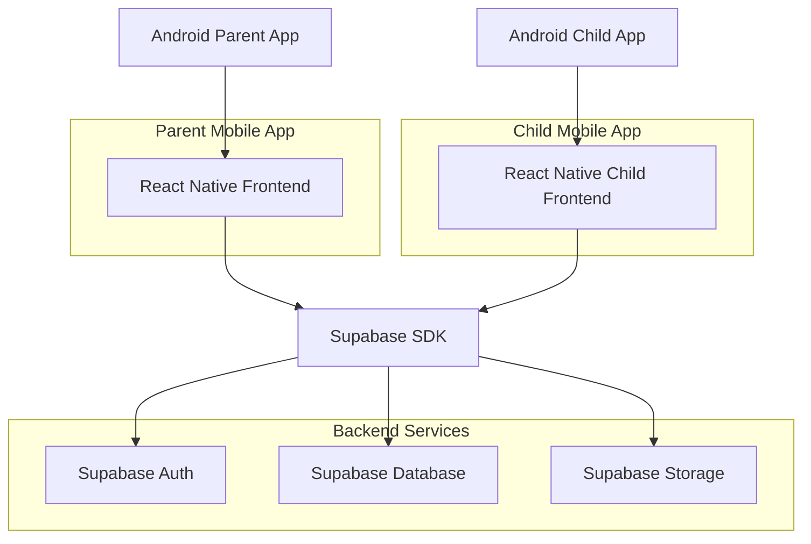
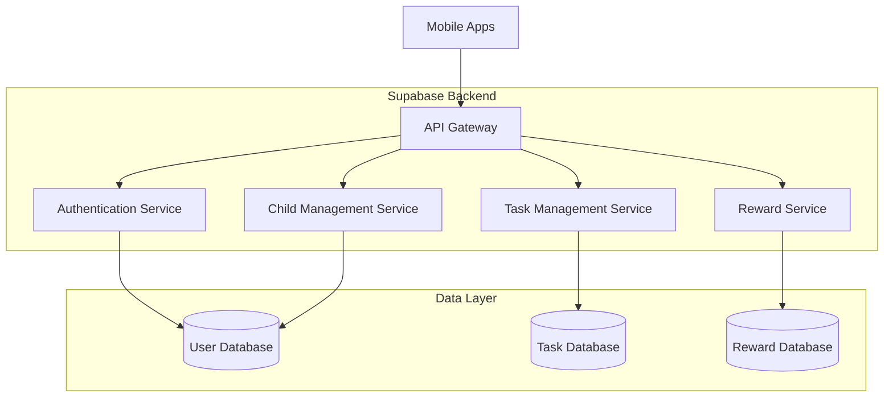
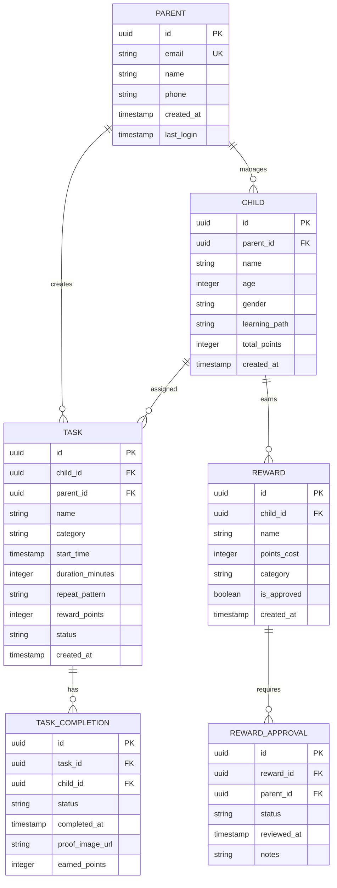

## 1. Architecture design



## 2. Technology Description
- **Frontend**: React Native@0.72 + Native Android Components
- **Backend**: Supabase (PostgreSQL, Auth, Storage, Real-time)
- **State Management**: React Context + AsyncStorage for offline
- **Push Notifications**: Firebase Cloud Messaging
- **Initialization Tool**: React Native CLI

## 3. Route definitions
| Route | Purpose |
|-------|---------|
| /onboarding/welcome | Initial welcome screen with value proposition |
| /onboarding/system | Three pillars explanation screen |
| /onboarding/parent-role | Parent leadership positioning |
| /onboarding/child-experience | Child safety reassurance |
| /onboarding/trust | Data privacy and trust building |
| /onboarding/permissions | System permissions request |
| /onboarding/account-setup | Registration and login entry |
| /dashboard | Main parent dashboard with child overview |
| /child/:id | Individual child detail dashboard |
| /task/create | Task creation form with scheduling |
| /task/edit/:id | Task editing interface |
| /rewards/approve | Reward approval management |
| /reports | Child progress reports and analytics |
| /settings | Parent app configuration |

## 4. API definitions

### 4.1 Authentication APIs

**Parent Registration**
```
POST /api/auth/register
```

Request:
| Param Name | Param Type | isRequired | Description |
|------------|-------------|-------------|-------------|
| email | string | true | Parent email address |
| password | string | true | Password (min 8 characters) |
| name | string | true | Parent full name |
| phone | string | true | Phone number for verification |

Response:
| Param Name | Param Type | Description |
|------------|-------------|-------------|
| user_id | uuid | Unique user identifier |
| token | string | JWT authentication token |
| refresh_token | string | Token for session refresh |

### 4.2 Child Management APIs

**Create Child Profile**
```
POST /api/children/create
```

Request:
| Param Name | Param Type | isRequired | Description |
|------------|-------------|-------------|-------------|
| name | string | true | Child's name |
| age | integer | true | Child's age |
| gender | string | false | Child's gender |
| learning_path | string | true | Selected learning focus |

Response:
| Param Name | Param Type | Description |
|------------|-------------|-------------|
| child_id | uuid | Unique child identifier |
| created_at | timestamp | Profile creation time |

### 4.3 Task Management APIs

**Create Task**
```
POST /api/tasks/create
```

Request:
| Param Name | Param Type | isRequired | Description |
|------------|-------------|-------------|-------------|
| child_id | uuid | true | Target child identifier |
| name | string | true | Task name |
| category | string | true | Task category (discipline/learning/creativity/responsibility/money) |
| start_time | timestamp | true | Task start time |
| duration | integer | true | Duration in minutes |
| repeat_pattern | string | true | Repeat frequency |
| reward_points | integer | false | Points for completion |

Response:
| Param Name | Param Type | Description |
|------------|-------------|-------------|
| task_id | uuid | Unique task identifier |
| status | string | Task creation status |

## 5. Server architecture diagram



## 6. Data model

### 6.1 Data model definition



### 6.2 Data Definition Language

**Parents Table**
```sql
-- Create parents table
CREATE TABLE parents (
    id UUID PRIMARY KEY DEFAULT gen_random_uuid(),
    email VARCHAR(255) UNIQUE NOT NULL,
    name VARCHAR(100) NOT NULL,
    phone VARCHAR(20) NOT NULL,
    password_hash VARCHAR(255) NOT NULL,
    created_at TIMESTAMP WITH TIME ZONE DEFAULT NOW(),
    last_login TIMESTAMP WITH TIME ZONE,
    is_active BOOLEAN DEFAULT true
);

-- Create index for email lookups
CREATE INDEX idx_parents_email ON parents(email);
CREATE INDEX idx_parents_created_at ON parents(created_at DESC);
```

**Children Table**
```sql
-- Create children table
CREATE TABLE children (
    id UUID PRIMARY KEY DEFAULT gen_random_uuid(),
    parent_id UUID NOT NULL REFERENCES parents(id) ON DELETE CASCADE,
    name VARCHAR(100) NOT NULL,
    age INTEGER CHECK (age >= 3 AND age <= 18),
    gender VARCHAR(10) CHECK (gender IN ('male', 'female', 'other')),
    learning_path VARCHAR(50) DEFAULT 'general',
    total_points INTEGER DEFAULT 0,
    created_at TIMESTAMP WITH TIME ZONE DEFAULT NOW(),
    is_active BOOLEAN DEFAULT true
);

-- Create indexes
CREATE INDEX idx_children_parent_id ON children(parent_id);
CREATE INDEX idx_children_created_at ON children(created_at DESC);
```

**Tasks Table**
```sql
-- Create tasks table
CREATE TABLE tasks (
    id UUID PRIMARY KEY DEFAULT gen_random_uuid(),
    child_id UUID NOT NULL REFERENCES children(id) ON DELETE CASCADE,
    parent_id UUID NOT NULL REFERENCES parents(id) ON DELETE CASCADE,
    name VARCHAR(200) NOT NULL,
    category VARCHAR(50) CHECK (category IN ('discipline', 'learning', 'creativity', 'responsibility', 'money_habit')),
    start_time TIMESTAMP WITH TIME ZONE NOT NULL,
    duration_minutes INTEGER DEFAULT 30,
    repeat_pattern VARCHAR(20) DEFAULT 'once' CHECK (repeat_pattern IN ('once', 'daily', 'weekdays', 'custom')),
    reward_points INTEGER DEFAULT 0,
    status VARCHAR(20) DEFAULT 'pending' CHECK (status IN ('pending', 'active', 'completed', 'overdue', 'cancelled')),
    created_at TIMESTAMP WITH TIME ZONE DEFAULT NOW(),
    updated_at TIMESTAMP WITH TIME ZONE DEFAULT NOW()
);

-- Create indexes
CREATE INDEX idx_tasks_child_id ON tasks(child_id);
CREATE INDEX idx_tasks_parent_id ON tasks(parent_id);
CREATE INDEX idx_tasks_start_time ON tasks(start_time);
CREATE INDEX idx_tasks_status ON tasks(status);
```

**Task Completions Table**
```sql
-- Create task_completions table
CREATE TABLE task_completions (
    id UUID PRIMARY KEY DEFAULT gen_random_uuid(),
    task_id UUID NOT NULL REFERENCES tasks(id) ON DELETE CASCADE,
    child_id UUID NOT NULL REFERENCES children(id) ON DELETE CASCADE,
    status VARCHAR(20) CHECK (status IN ('pending', 'completed', 'failed')),
    completed_at TIMESTAMP WITH TIME ZONE,
    proof_image_url TEXT,
    earned_points INTEGER DEFAULT 0,
    created_at TIMESTAMP WITH TIME ZONE DEFAULT NOW()
);

-- Create indexes
CREATE INDEX idx_completions_task_id ON task_completions(task_id);
CREATE INDEX idx_completions_child_id ON task_completions(child_id);
CREATE INDEX idx_completions_completed_at ON task_completions(completed_at DESC);
```

**Supabase Row Level Security (RLS) Policies**
```sql
-- Enable RLS on all tables
ALTER TABLE parents ENABLE ROW LEVEL SECURITY;
ALTER TABLE children ENABLE ROW LEVEL SECURITY;
ALTER TABLE tasks ENABLE ROW LEVEL SECURITY;
ALTER TABLE task_completions ENABLE ROW LEVEL SECURITY;

-- Parents can only see their own data
CREATE POLICY "Parents can view own profile" ON parents
    FOR SELECT USING (auth.uid() = id);

-- Parents can manage their own children
CREATE POLICY "Parents can manage own children" ON children
    FOR ALL USING (parent_id = auth.uid());

-- Parents can manage tasks for their children
CREATE POLICY "Parents can manage own tasks" ON tasks
    FOR ALL USING (parent_id = auth.uid());

-- Basic permissions for authenticated users
GRANT SELECT ON parents TO authenticated;
GRANT ALL ON children TO authenticated;
GRANT ALL ON tasks TO authenticated;
GRANT ALL ON task_completions TO authenticated;
```